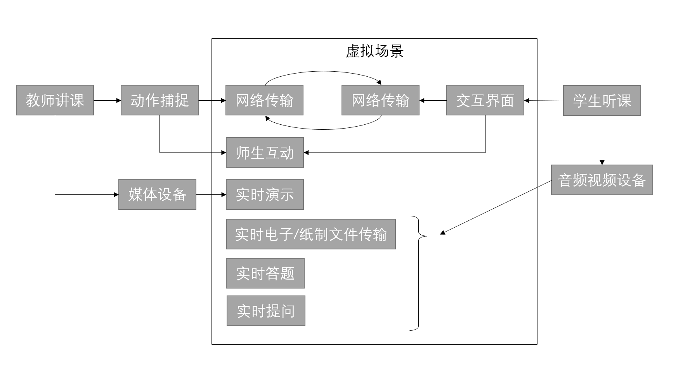

## 1.请结合你自己在在线教育的实际应用经历，分析当前在线教育存在的不足；

答：我体会到在线教育的几点不足有：

* 各家平台相互竞争，形式各异，导致资源分散；
  * 我在获取在线教育资源时，经常需要在各种平台间切换。有的平台是在线网页，有的是微信小程序，有的是手机APP。形式丰富看似给人提供了便利，实则为人带来了麻烦。造成这种现象的原因，是各家平台间互相竞争，没有统一的惯例和标准。
* 教学形式单一，未利用好现今多媒体技术的能力；
  * 现在的在线教育平台，大多只是以往教学形式的延伸，并未针对在线环境带来的优势做出革新。教学形式仍为视频授课和书面作业，听课-做课后习题-复习-考试的形式依然没有改变。
* 平台资源和数据太封闭，统计数据难以汇总利用。
  * 平台没有及时的数据反馈，使得学生难以得知自己的学习情况。缺少学习时的数据记录、课程视频和参考资料下载、习题和成绩导出。

## 2.设想未来智能化课堂教学的场景，新的功能和交互方式，用示意图表达你的设想；

答：未来的教学方式会多样化，课堂教学会从主要教学方式，演变成一种可选的教学方式。结合现有的网络技术，以及未来虚拟现实、元宇宙的发展趋势，我设想如下：

## 3.设想大数据分析怎样实现个性画像，进而支持学习内容的个性化推荐？

答：每个人都是独一无二的，都有自己的个性和长处。因此，每个人都有适合自己的学习内容和学习方式。大数据分析能够以小见大，寻找到最适合个人的学习内容和方式。大数据分析可通过个人在网络的浏览行为，找到感兴趣的领域；可以通过视频浏览、网上购物、公开发布的信息找到个人的兴趣点。进而通过一系列定制的测试摸清个人的知识水平和能够接受的学习方法。用以上内容作为出发点，结合已经收集的线上大数据，为个人寻找最适合的内容。

## 4.设想人工智能怎样作为虚拟助教或导师？

答：人工智能可以通过自然语言处理、语音识别等技术，识别学生的主观题目作业和文本。通过大数据集训练，可以为学生作业进行打分评价。机器学习可以找出学生作业中潜藏的模式，从而对学生进行个性化的问题分析。通过网络和计算机的应用，还可以将学生学习的相关数据和发现的问题汇总，并为学生提供个性化的评估和解决方案。
